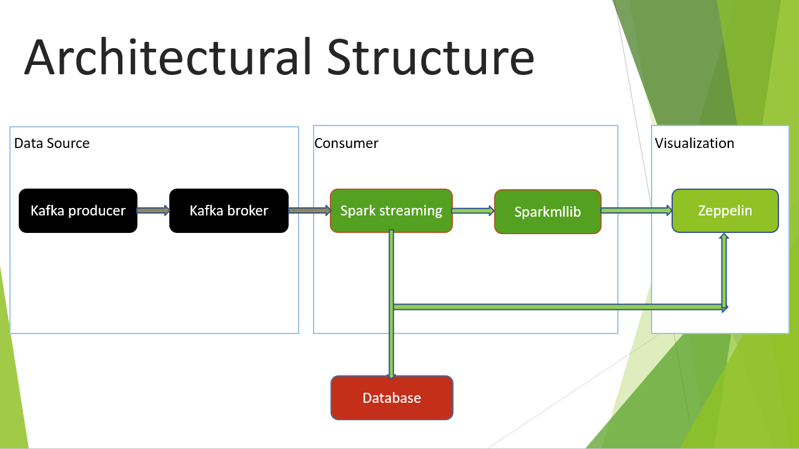

# Covid19_Analysis_Using_twitter_tweets

## Installation
1 - You need to apply for a Developer account of twitter to fetch tweets  
2 - Install Kafka and create a topic, consumer group ,consumer and topic  
(For doing this you can follow my blog:- https://medium.com/rock-your-data/getting-started-with-apache-kafka-efc616bd6dd5)  
3 - Change the File Location in resources folder  
4 - Run the Producer  
5 - Run the Consumer  

## Architecture

